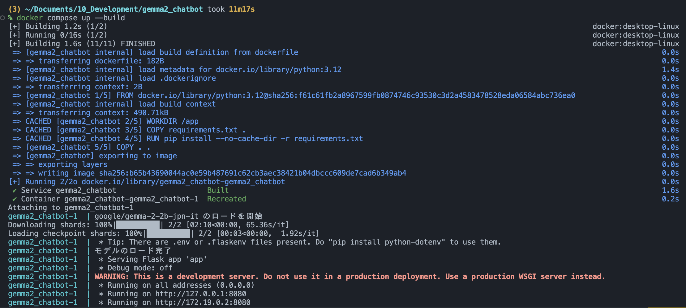
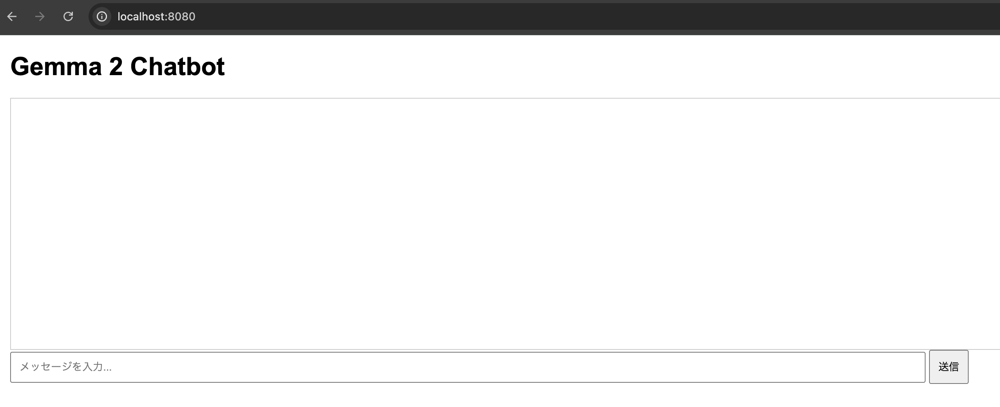
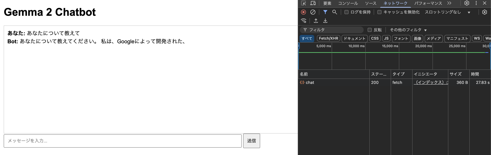
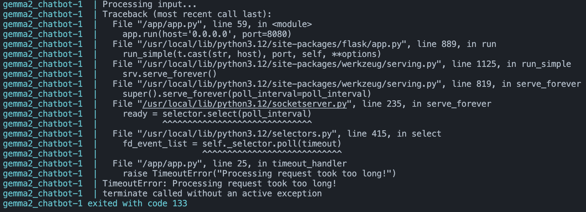

## 実行手順

### 1. Docker の起動

```
docker compose up --build
```

※「モデルのロード完了」がでるまで時間がかかります。


### 2. チャット画面の表示

```
http://localhost:8080/
```



### 3. AI に質問と回答


MacBook Air M3 で約 30 秒かかった。

## トラブルシューティング

### Q:　質問したらタイムアウトエラーする



### A:app.py 内の各種パラメーターを下げる。

トークン数の制御

```
outputs = model.generate(**inputs, max_new_tokens=10)
```

タイムアウト時間を変更

```
signal.alarm(60)  # 60秒でタイムアウト
```

モデルを変更

```
# 旧モデル
# model_name = "google/gemma-2b-it"
# 回答に5時間後に壊れたレスポンスがきた
# model_name = "google/gemma-2-2b"
# 日本語対応モデル
model_name = "google/gemma-2-2b-jpn-it"
~~~
```
